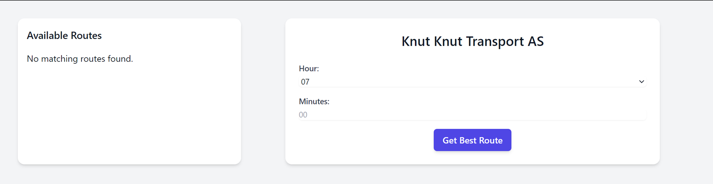

# Best Route App

The **Best Route App** is designed for **Knut Knut Transport AS** to identify the most cost-effective and efficient delivery routes. The app uses the **Fortuna algorithm** combined with **k-nearest neighbors (k-NN)** to predict the best route, factoring in various data points such as traffic and departure times. As the app is used over time, it can improve by learning from historical data.



## Features
- Predicts the most efficient delivery route based on real-time and historical data.
- Helps reduce fuel costs and optimize delivery times.
- Grows smarter with more usage data, adapting to patterns and improving predictions.
  
## How It Works
The app relies on a combination of:
- **Fortuna Algorithm**: A machine learning algorithm that uses historical and real-time data to find the best possible routes.
- **K-Nearest Neighbors (k-NN)**: This algorithm helps in refining route predictions based on proximity to other known optimal routes.

## Future Potential
As the app collects more usage data, it will continue to improve, offering better suggestions and more optimized routes to Knut Knut.

you could make this feature

## How to Run

1. Clone the repository:
   ```bash
   git clone https://github.com/valiantlynx/best-route-app.git
   cd best-route-app
   ```

2. Set up a Python virtual environment:
   ```bash
   python -m venv .venv
   ```

3. Activate the virtual environment:
   - On Windows:
     ```bash
     .venv\Scripts\activate
     ```
   - On macOS/Linux:
     ```bash
     source .venv/bin/activate
     ```

4. Install the required dependencies:
   ```bash
   pip install -r requirements.txt
   ```

5. Run the app:
   ```bash
   cd src/
   python knut_knut_app.py
   ```

The app will now start and begin finding the best routes for delivery.
